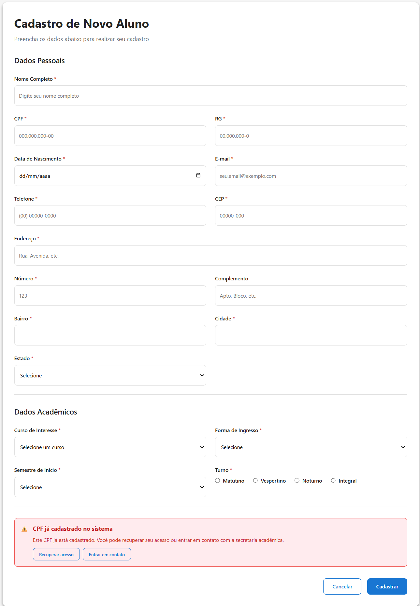
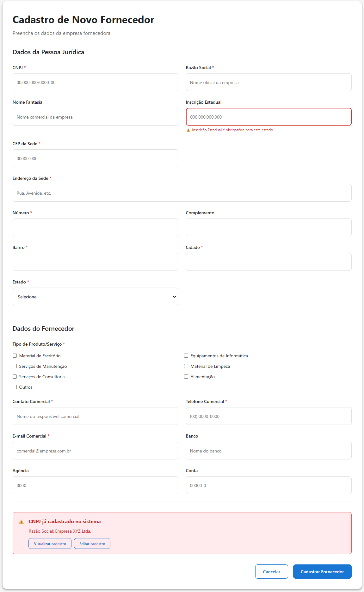
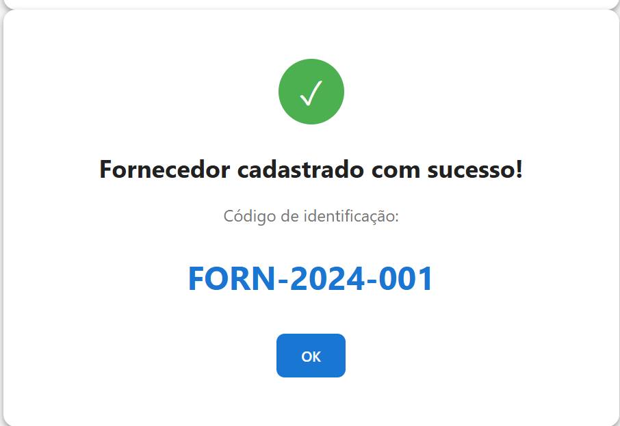

# Projeto Integrador - Desenvolvimento de Sistemas Orientados a Objetos

## 📋 Sobre o Projeto

Este é o repositório do **Projeto Integrador** da disciplina de Desenvolvimento de Sistemas Orientados a Objetos. O projeto está em sua **segunda entrega**, focada na prototipação do sistema que foi formalizado na primeira fase através de diagramas UML.

A Linguagem Unificada de Modelagem (UML) foi utilizada para visualizar e padronizar o projeto, facilitando o entendimento por toda a equipe de desenvolvimento.

## 🎯 Objetivo

Desenvolver protótipos funcionais da interface do sistema, refletindo a modelagem realizada na primeira fase do projeto através dos diagramas de caso de uso.

## ✨ Funcionalidades Principais

O sistema contempla as seguintes jornadas de cadastro:

- **Cadastro de Pessoa Física**
- **Cadastro de Pessoa Jurídica**
- **Cadastro de Professores**
- **Cadastro de Fornecedores**
- **Cadastro de Alunos**

## 🛠️ Tecnologias e Ferramentas

- **UML** - Para modelagem e diagramação do sistema
- **HTML CSS JS** - Para desenvolvimento dos protótipos funcionais
- **Markdown** - Para documentação do projeto
- **Git/GitHub** - Para controle de versão e colaboração

## 📁 Estrutura do Projeto

```
2503-686288-PROJETO-INTEGRADOR/
│
├── README.md                    # Documentação principal do projeto
├── instricuoesgerais.md         # Instruções gerais da segunda entrega
├── prototipo-visual.html        # Protótipo funcional da interface
└── imagens/                     # Imagens dos protótipos e telas do sistema

```

## 📊 Diagramas UML

> **Nota:** Os diagramas desenvolvidos na primeira fase do projeto serão adicionados aqui em formato Markdown.

### Diagramas Disponíveis:
- Diagrama de Casos de Uso
- Diagrama de Classes
- Outros diagramas relevantes...

## 🎨 Protótipos de Interface

### Protótipo Funcional

O protótipo funcional completo da interface está disponível no arquivo HTML:

📄 **[Acessar Protótipo Visual](prototipo-visual.html)**

### Telas de Cadastro

Abaixo estão as telas desenvolvidas para as diferentes jornadas de cadastro do sistema:

#### Cadastro de Aluno



**Tela de Sucesso:**


#### Cadastro de Professor


**Tela de Sucesso:**


#### Cadastro de Fornecedor



**Tela de Sucesso:**


## 📝 Entregas do Projeto

### Fase 1 - Modelagem (Concluída)
- [x] Desenvolvimento dos diagramas UML
- [x] Diagramas de caso de uso
- [x] Modelagem do sistema

### Fase 2 - Prototipação (Concluída)
- [x] Desenvolvimento dos protótipos de interface
- [x] Protótipos das jornadas de cadastro
- [x] Documentação no README.md
- [x] Anexação dos protótipos e diagramas